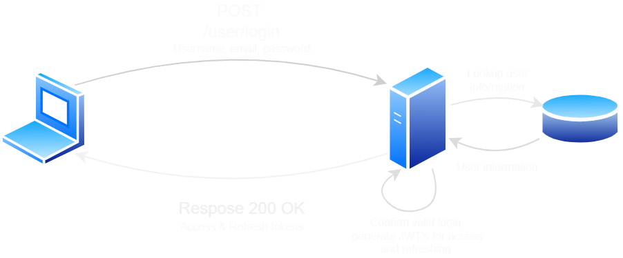

# Drop Bear Table

## Overview
Drop Bear Table is a web application designed to make table reservations at restaurants online. This project was created as a part of my software development portfolio to demonstrate my ability to work across the full web tech stack and learn both new technologies and concepts as I go.

In terms of a general overview, the project was made using MongoDB, Express.js, Vue 3, and Node.js. There is full CRUD functionality implemented in terms of both restaurants and reservations, with authorisation and authentication handled through the use of JWT’s and three distinct user groups.

If you have any questions about the project, or simply would like to know more about it, please feel free to get in contact with me.  

## Table of Contents
- [Overview](#overview)
- [Starting & Stopping the Project](#starting--stopping-the-project)
- [User Authentication & Authoriation](#user-authentication--authorisation)

## Starting & Stopping the Project
#### Running the Project
- Creating a clone of the project in a directory of your choice.
- Ensure that both [Docker](https://www.docker.com/products/docker-desktop) and [Docker Compose](https://docs.docker.com/compose/install/) are installed.
- In the terminal, run the command `docker-compose up -d` or `docker compose up -d` in the project directory.
- Server-side: visit [http://localhost:3000](http://localhost:3000).
- MongoDB: visit [http://localhost:8081](http://localhost:8081).
- Client-side: visit [http://localhost:8080](http://localhost:8080).

#### Shutting Down the Project
- Run the command `docker-compose down -v` in a terminal in the project directory to stop the running containers and remove the volumes.

## User Authentication & Authorisation
JSON Web Tokens are used as a key part of the auth system for the project. JWT’s were chosen because they offer a great deal of flexibility and can be scaled easily in the case that a system is broken out into a series of micro services, which is not the case for traditional session ID cookies.

#### Logging In & Out
In order to use the web app, the user must first make a POST request to the login endpoint with a username and password. The server then looks up the information for the given username in the database, comparing the sent password to the hashed password that is stored. In the case that the server has been sent valid login information, an access token is generated and sent to the user to be used for authorisation on future requests.

To improve security, this access token expires after 15 minutes. As such, an additional refresh token is also sent to the user on login which has no expiration but is also stored in the database. This refresh token can be sent to the token endpoint at any time in order to generate a new access token.

The actions of a successful login are shown in the diagram below.

#### Token Refreshing
When the user makes a request for a new access token, they send their refresh token to the server. The sent refresh token is compared to the users stored refresh token, and a new access token is generated if they are both the same. The users refresh token is deleted from the database when they log out and, and such, is no longer valid for the generation of new access tokens. A new refresh token will be generated when the users logs back in.

#### Access Control & User Groups
Access control is handled by having three types of users within the system: admins, restaurateurs, and standard users. Admins can create, read, update, and delete all restaurants and reservations. Restaurateurs can create restaurants, read information about all restaurants, but only update and delete restaurants they have created. They cannot create reservations. Users can read information about all restaurants, but cannot create, update, or delete them. They can also create reservations, and read, update and delete their reservations.